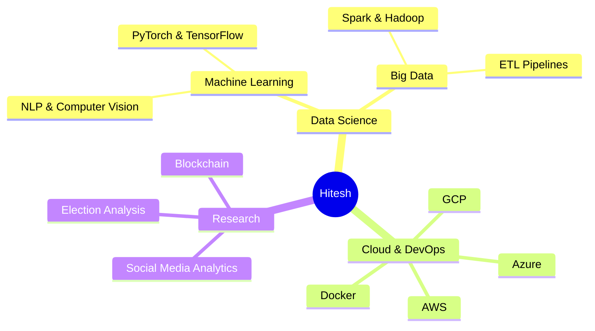

<div align="center">

# ```diff
+ print("Hello World 👋, I'm Hitesh!")
```

[](https://visitorbadge.io/status?path=Hit07n)

<a href="https://www.linkedin.com/in/hiteshnarayan/" target="_blank">
  
</a>
<a href="https://hit07.github.io/" target="_blank">
  
</a>
<a href="mailto:hiteshna@usc.edu">
  
</a>
<a href="https://tinyurl.com/6hzxjfav" target="_blank">
  
</a>

</div>

## ```python
def about_me():
    return {
        "role": "MS CS Student @ USC | Research Assistant @ ISI HUMANS Lab",
        "passion": ["Machine Learning 🤖", "Data Engineering 📊", "Cloud Architecture ☁️"],
        "seeking": "Data Science & ML Engineering Internships",
        "achievement": "HackSC'24 SoCal Runner-up 🏆",
        "location": "Los Angeles, CA 📍"
    }
```

<div align="center">

## 🎯 Current Focus



</div>

## 🛠️ Technology Arsenal

<table align="center">
<tr>
<td align="center" width="33%">

### 🐍 Core Languages
```python
languages = {
    "Python": "Expert ⭐⭐⭐⭐⭐",
    "SQL": "Advanced ⭐⭐⭐⭐",
    "C/C++": "Intermediate ⭐⭐⭐",
    "Java": "Proficient ⭐⭐⭐"
}
```

</td>
<td align="center" width="33%">

### 🤖 AI/ML Tools
```python
ml_tools = {
    "PyTorch": "Production",
    "TensorFlow": "Advanced",
    "Scikit-learn": "Expert",
    "HuggingFace": "Advanced",
    "NLTK & spaCy": "Proficient"
}
```

</td>
<td align="center" width="33%">

### ☁️ Cloud & DevOps
```python
cloud = {
    "AWS": ["Lambda", "S3", "EC2"],
    "Azure": ["Functions", "ML"],
    "GCP": ["BigQuery", "AI"],
    "Docker": "Containerization"
}
```

</td>
</tr>
<tr>
<td align="center" width="33%">

### 📊 Data Engineering
```python
data_stack = {
    "Processing": ["Spark", "Hadoop"],
    "Visualization": ["Power BI", "Tableau"],
    "Databases": ["PostgreSQL", "MongoDB"],
    "Vector DBs": ["Weaviate", "Pinecone"]
}
```

</td>
<td align="center" width="33%">

### 🌐 Web Tech
```python
web_stack = {
    "Backend": ["Flask", "FastAPI"],
    "Frontend": ["HTML", "CSS", "JS"],
    "Framework": ["Bootstrap", "React"],
    "Database": ["Firebase", "SQLite"]
}
```

</td>
<td align="center" width="33%">

### 🔧 Dev Tools
```python
tools = {
    "Version Control": ["Git", "GitHub"],
    "IDE": ["VSCode", "PyCharm"],
    "API Testing": ["Postman"],
    "CI/CD": ["GitHub Actions"]
}
```

</td>
</tr>
</table>

## 🚀 Featured Projects

<table align="center">
<tr>
<td width="50%">

### 🏋️ FitGPT - AI Fitness Coach
 

- 🏆 **HackSC'24 SoCal Runner-up**
- 🤖 Personalized workout recommendations using GPT-4
- 📈 40% improvement in recommendation accuracy
- 🔗 [View Project](https://github.com/Hit07/FitGPT)

</td>
<td width="50%">

### 🔍 Vector Search Engine


- 🎯 80% retrieval accuracy for complex queries
- 🚀 40% efficiency improvement in data ingestion
- 🔄 Automated ETL pipelines
- 🔗 [View Project](https://github.com/Hit07/vector-search)

</td>
</tr>
<tr>
<td width="50%">

### 🏃‍♂️ Human Activity Classification


- 📊 94% accuracy across 7 activities
- 🔄 Advanced feature engineering
- 📈 12% boost via SMOTE & PCA
- 🔗 [View Project](https://github.com/Hit07/activity-classification)

</td>
<td width="50%">

### 🖼️ Scene Classification


- 🎯 88.56% F1 Score
- 🔄 Transfer learning with 4 CNN architectures
- 📈 40% error reduction
- 🔗 [View Project](https://github.com/Hit07/scene-classification)

</td>
</tr>
</table>

## 📈 GitHub Analytics

<div align="center">

<a href="https://github.com/Hit07">
  
  
</a>

### 📊 Weekly Development Breakdown

```text
Python       █████████████░░░░░░   65.5%
SQL          ████░░░░░░░░░░░░░░   20.0%
C++          ██░░░░░░░░░░░░░░░░   10.0%
Other        █░░░░░░░░░░░░░░░░░    4.5%
```

</div>

## 📚 Latest Publications

```js
const publications = [
  {
    title: "Social Media Discourse: 2024 U.S. Presidential Election on Twitter/X",
    journal: "arXiv preprint",
    date: "Nov 2024",
    coAuthors: ["A. Balasubramanian", "V. Zou", "C. You", "L. Luceri", "E. Ferrara"]
  },
  {
    title: "E-voting Using Blockchain & Homomorphic Encryption",
    journal: "IJRASET",
    date: "Jul 2023",
    pages: "54573-54582"
  }
];
```

## 💬 Let's Connect!

<div align="center">

```python
def contact_me():
    return {
        "email": "hiteshna@usc.edu",
        "linkedin": "linkedin.com/in/hiteshnarayan",
        "portfolio": "hit07.github.io",
        "location": "Los Angeles, CA"
    }
```

---
*"Innovation distinguishes between a leader and a follower." - Steve Jobs*

</div>
